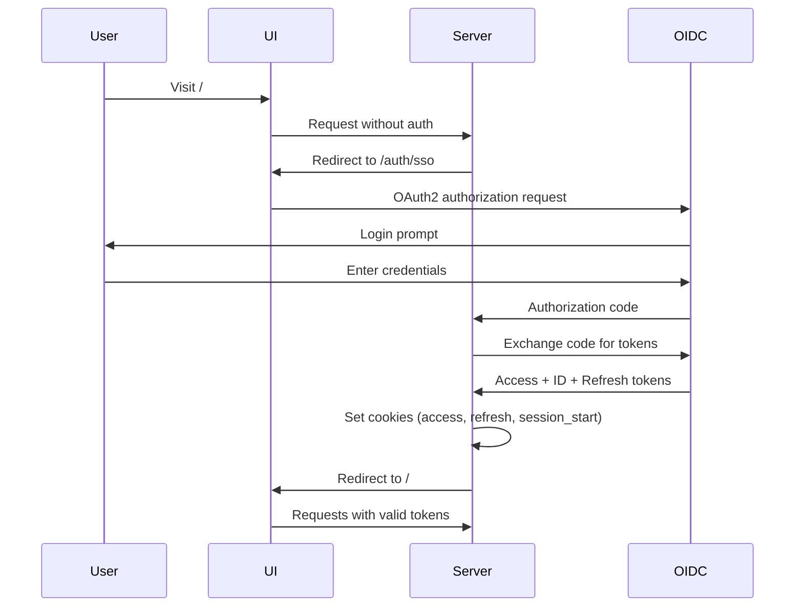
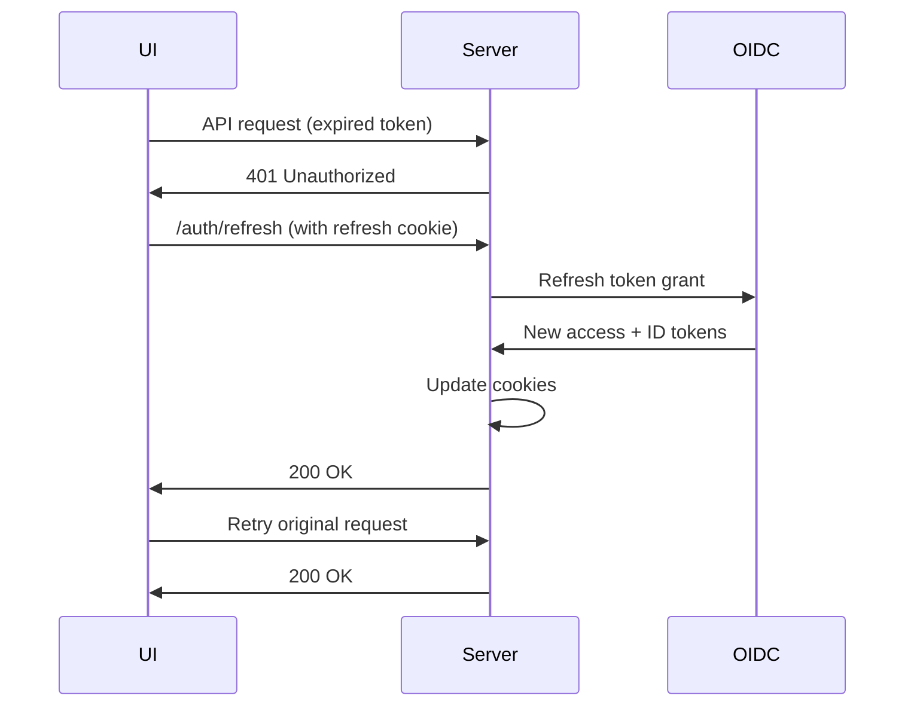
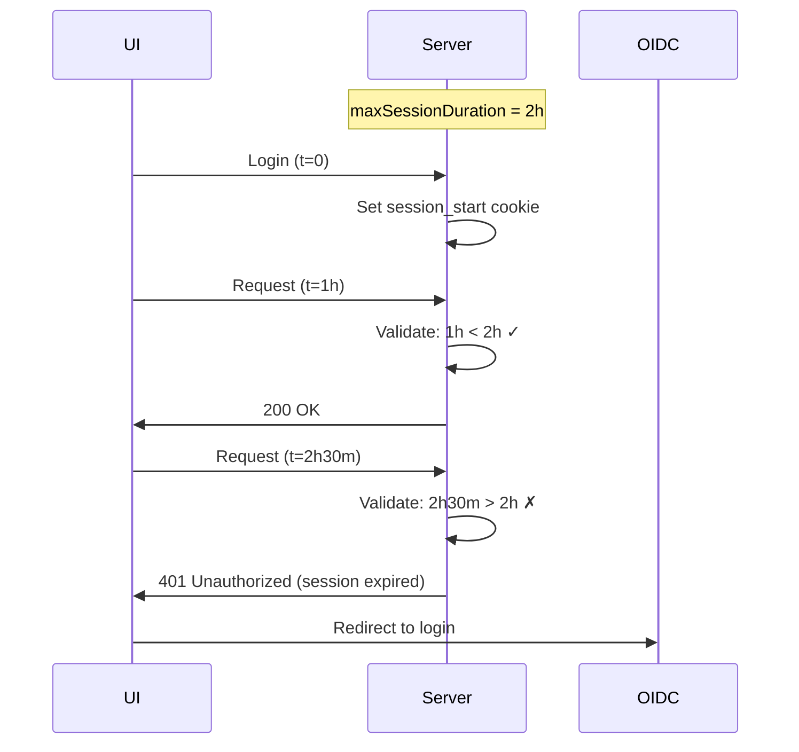

# OAuth2 Authentication with Refresh Tokens and Session Management

Temporal UI implements OAuth2/OIDC authentication with automatic token refresh and configurable session duration for secure, uninterrupted user sessions.

## Table of Contents

- [Quick Start](#quick-start)
- [Features](#features)
- [Configuration](#configuration)
- [Testing](#testing)
- [How It Works](#how-it-works)
- [Security Considerations](#security-considerations)
- [Troubleshooting](#troubleshooting)

## Quick Start

### Local Development with Auth

```bash
pnpm dev:with-auth
```

This starts:

- **Vite dev server**: http://localhost:3000
- **UI Server (Go)**: http://localhost:8081
- **OIDC Server**: http://localhost:8889
- **Temporal Server**: http://localhost:7233

Login with any username (e.g., `testuser`) and experience automatic token refresh.

## Features

### 1. Automatic Token Refresh

Access tokens expire after a short period (60s in dev), but the UI automatically refreshes them using a long-lived refresh token, preventing session interruptions.

**User Experience:**

- ✅ No login prompts during active sessions
- ✅ Seamless API requests even after token expiry
- ✅ No visible interruptions

### 2. Configurable Max Session Duration

Enforce a hard limit on session lifetime independent of token expiry. Users must re-authenticate after the configured duration, regardless of activity.

**Use Cases:**

- **Security Compliance**: Force re-auth every N hours
- **High-Security Environments**: Short sessions (30m-2h)
- **Low-Risk Environments**: Longer sessions (8h-24h) or unlimited

### 3. Secure Cookie-Based Storage

- **Refresh tokens**: HttpOnly cookies (not accessible to JavaScript)
- **Access/ID tokens**: Short-lived cookies (1 minute)
- **Session tracking**: HttpOnly `session_start` cookie

### 4. Logout Functionality

Clear all authentication state and redirect to login:

```typescript
import { logout } from '$lib/stores/auth-user';

<button onclick={logout}>Logout</button>
```

## Configuration

### UI Server Config (`server/config/with-auth.yaml`)

```yaml
auth:
  enabled: true
  maxSessionDuration: 2m # Max time before forced re-login
  providers:
    - label: My OIDC Provider
      type: oidc
      providerUrl: https://auth.example.com
      clientId: temporal-ui
      clientSecret: <secret>
      scopes:
        - openid
        - profile
        - email
        - offline_access # Required for refresh tokens
      callbackUrl: https://ui.example.com/auth/sso/callback
```

#### Max Session Duration

Controls the total session lifetime:

| Value             | Behavior                                                                    |
| ----------------- | --------------------------------------------------------------------------- |
| `0` or omitted    | Unlimited session (tokens refresh indefinitely until refresh token expires) |
| `30m`, `1h`, `8h` | Session expires after this duration, forcing full re-authentication         |

**How it works:**

1. On login: Server sets `session_start` cookie with current timestamp
2. On each request: Server validates session age against `maxSessionDuration`
3. On expiry: Server returns 401, UI redirects to SSO login

**Difference from token expiry:**

| Mechanism                | Controls                 | Behavior on expiry                 |
| ------------------------ | ------------------------ | ---------------------------------- |
| **Token TTL**            | How often tokens refresh | Silent refresh via `/auth/refresh` |
| **Max Session Duration** | Total session lifetime   | Full re-authentication required    |

### OIDC Provider Requirements

Your OIDC provider must support:

1. **Grant types**: `authorization_code`, `refresh_token`
2. **Scopes**: Must include `offline_access` to issue refresh tokens
3. **Token lifetimes**:
   - Access token: Short (5m-1h recommended)
   - Refresh token: Long (7d-30d recommended)

### Example: Auth0 Configuration

```yaml
auth:
  providers:
    - label: Auth0
      type: oidc
      providerUrl: https://your-tenant.auth0.com
      clientId: your-client-id
      clientSecret: your-client-secret
      scopes:
        - openid
        - profile
        - email
        - offline_access
      callbackUrl: https://ui.example.com/auth/sso/callback
      options:
        audience: https://api.example.com
```

### Example: Keycloak Configuration

```yaml
auth:
  providers:
    - label: Keycloak
      type: oidc
      providerUrl: https://keycloak.example.com/realms/temporal
      clientId: temporal-ui
      clientSecret: your-client-secret
      scopes:
        - openid
        - profile
        - email
        - offline_access
      callbackUrl: https://ui.example.com/auth/sso/callback
```

## Testing

### Test Scenario 1: Token Refresh

Verify tokens refresh automatically before expiry.

**Setup:**

```yaml
# server/config/with-auth.yaml
auth:
  maxSessionDuration: 5m
```

```typescript
// utilities/oidc-server/support/configuration.ts (dev only)
ttl: {
  AccessToken: 60,      // 1 minute
  RefreshToken: 86400,  // 1 day
}
```

**Steps:**

1. Login at http://localhost:3000
2. Open DevTools → Network tab
3. Wait 60+ seconds
4. Navigate to a different page
5. Observe automatic `/auth/refresh` request
6. Original request retries successfully

**Expected:**

- First request: 401 Unauthorized (expired token)
- `/auth/refresh`: 200 OK (new tokens)
- Retry: 200 OK (with new token)
- No login prompt

### Test Scenario 2: Session Expiry

Verify sessions expire and force re-login.

**Setup:**

```yaml
# server/config/with-auth.yaml
auth:
  maxSessionDuration: 2m
```

```typescript
// utilities/oidc-server/support/configuration.ts
ttl: {
  Session: 120,  // Match maxSessionDuration
}
```

**Steps:**

1. Login at http://localhost:3000
2. Wait 2+ minutes
3. Make any API request or navigate

**Expected:**

- Request: 401 Unauthorized ("session expired")
- Redirect to OIDC login page
- Must re-enter credentials

### Test Scenario 3: Unlimited Sessions

Verify sessions can last indefinitely with only token refresh.

**Setup:**

```yaml
# server/config/with-auth.yaml
auth:
  maxSessionDuration: 0 # Disable session limit
```

```typescript
// utilities/oidc-server/support/configuration.ts
ttl: {
  RefreshToken: 86400 * 7,  // 7 days
}
```

**Expected:**

- Tokens refresh silently every 60 seconds
- Session lasts until refresh token expires (7 days)
- No forced re-authentication

### Test Scenario 4: Logout

Verify logout clears all auth state.

**Steps:**

1. Login and verify cookies exist (DevTools → Application → Cookies)
2. Call logout:
   ```typescript
   import { logout } from '$lib/stores/auth-user';
   logout();
   ```
3. Check cookies are cleared
4. Verify redirect to login page

**Expected:**

- All cookies cleared (`refresh`, `user0`, `user1`, etc.)
- Redirect to root (`/`)
- Must login again to access UI

## How It Works

### Initial Authentication Flow



### Token Refresh Flow



### Session Duration Validation



### Token Lifecycle

```
Login                Token Expiry         Session Expiry       Refresh Token Expiry
  ↓                       ↓                     ↓                      ↓
  |======================>|===================>|====================>|
  |                       |                    |                     |
  | Access Token: 60s     | Refresh: ~1min     | Re-auth required    | Full login required
  | ID Token: 60s         | Silent, automatic  | User prompted       | Session ends
  | Refresh Token: 1-30d  |                    |                     |
  | Session: 0-24h        |                    |                     |
```

## Security Considerations

### Implemented Security Features

✅ **HttpOnly Cookies**: Refresh tokens not accessible to JavaScript (XSS protection)
✅ **Secure Flag**: Cookies only sent over HTTPS in production
✅ **SameSite=Strict**: CSRF protection
✅ **Dynamic Cookie Lifetime**: Matches IdP refresh token expiry (prevents stale cookies)
✅ **JWT Signature Validation**: All tokens cryptographically verified
✅ **Fail-Secure Token Validation**: Missing verifier or empty tokens cause auth failure
✅ **Session Duration Enforcement**: Hard limit on session lifetime

### Known Limitations

These are pre-existing architectural decisions documented for future improvement:

⚠️ **Tokens in localStorage**: Access tokens stored in browser localStorage (XSS vulnerability)
⚠️ **Non-HttpOnly User Cookies**: Some user data cookies accessible to JavaScript
⚠️ **No Token Rotation**: Refresh tokens reused (acceptable with short lifetimes)
⚠️ **No Server-Side Revocation**: Can't revoke tokens server-side before natural expiry

See `ARCHITECTURE_REFACTOR_TODO.md` for detailed remediation plans.

### Production Recommendations

1. **Token Lifetimes**:

   - Access token: 5-15 minutes
   - Refresh token: 7-30 days
   - Session duration: Based on security requirements (1h-8h typical)

2. **HTTPS Required**: Always use HTTPS in production for Secure cookie flag

3. **Monitor Refresh Failures**: Alert on high refresh failure rates

4. **Configure Session Duration**: Set `maxSessionDuration` based on compliance requirements

## Troubleshooting

### Issue: Tokens not refreshing

**Symptoms**: Login required every time access token expires

**Check:**

1. `offline_access` scope in configuration
2. OIDC provider supports `refresh_token` grant type
3. Browser DevTools → Cookies: `refresh` cookie exists
4. Server logs for refresh errors

**Solution:**

```yaml
auth:
  providers:
    - scopes:
        - openid
        - profile
        - email
        - offline_access # Must include this
```

### Issue: Session expires too quickly

**Symptoms**: Forced to login every few minutes

**Check:**

```yaml
# server/config/with-auth.yaml
auth:
  maxSessionDuration: 2m # ← Too short
```

**Solution:**
Increase or disable:

```yaml
auth:
  maxSessionDuration: 8h # Or 0 for unlimited
```

### Issue: Session lasts too long

**Symptoms**: Users stay logged in indefinitely

**Check:**

```yaml
auth:
  maxSessionDuration: 0 # ← Unlimited
```

**Solution:**
Set appropriate limit:

```yaml
auth:
  maxSessionDuration: 8h # Force re-auth after 8 hours
```

### Issue: "authentication verifier not initialized" error

**Symptoms**: All auth requests fail with 401

**Check:**

1. OIDC provider URL accessible from server
2. `/.well-known/openid-configuration` endpoint responds
3. Server logs show OIDC discovery success

**Solution:**
Verify provider URL and network connectivity:

```bash
curl https://your-oidc-provider/.well-known/openid-configuration
```

### Issue: Logout doesn't work

**Symptoms**: Can still access UI after logout

**Check:**

1. Frontend calls `logout()` function
2. Server `/auth/logout` endpoint accessible
3. Cookies cleared in browser DevTools

**Debug:**

```bash
# Test logout endpoint
curl -X GET http://localhost:8081/auth/logout \
  --cookie "refresh=<token>" \
  -v
```

## Related Documentation

- **Testing Guide**: `TESTING_TOKEN_REFRESH.md` - Detailed testing procedures
- **Architecture Decisions**: `ARCHITECTURE_REFACTOR_TODO.md` - Future improvements
- **Auth Testing Skill**: `.claude/skills/auth-testing/SKILL.md` - Development workflow
- **Configuration**: `server/config/with-auth.yaml` - Server config reference

## Implementation Files

### Backend (Go)

- `server/server/auth/auth.go` - Token validation, session management
- `server/server/route/auth.go` - Auth routes (callback, refresh, logout)
- `server/server/config/config.go` - Auth configuration struct

### Frontend (TypeScript)

- `src/lib/stores/auth-user.ts` - Auth state management, logout
- `src/lib/utilities/auth-refresh.ts` - Automatic token refresh logic
- `src/lib/utilities/request-from-api.ts` - API client with auth

### Development

- `utilities/oidc-server/` - Local OIDC server for testing
- `server/config/with-auth.yaml` - Development auth configuration
