# Temporal UI Monorepo Migration

_Oregon Trail Edition_


## Overview

The Temporal UI team has loaded up their wagon, packed their crates,
and is ready to embark on a bold journey westward — toward the promised land of
a unified monorepo.

They’ve heard stories of faster builds, cleaner architecture, and shared
packages dancing freely across apps. But they’re also wary. The road is long,
and the terrain is unfamiliar. Some say entire builds have been lost to circular
dependencies. Others whisper of CI pipelines that vanished in the night.

And yet, there is hope. With careful planning, a trusty `pnpm` steed, and the
powerful `turborepo` oxen to pull us through, this migration can succeed. The
path won’t be easy — but it will be worth it.

## Goals

- Consolidate related packages and apps into a single workspace.
- Enable shared logic (schemas, components) to be centrally maintained.
- Cleanly separate OSS and internal UI code.
- Improve performance, coordination, and publishing workflows.

## Target Monorepo Layout

```
temporal-ui/
├── apps/
│   ├── cloud-ui/
│   ├── codec-server/
│   ├── dev-server/
│   └── oss-ui/
├── packages/
│   ├── schemas/
│   ├── oss-components/
│   └── holocene/
├── .github/
├── package.json
├── pnpm-workspace.yaml
└── turbo.json
```

## Repo/App/Package Relationships

```mermaid
flowchart TD
  subgraph private-ui-repo["🔒 Private UI Repo"]


    subgraph Packages
      schemas["📦 schemas"]
      oss-components["📦 oss components"]
      holocene["📦 holocene"]
    end

    subgraph Apps
      oss_ui["🧱 oss-ui"]
      cloud_ui["☁️ cloud-ui"]
      ui-server["🖥️ ui-server (Go)"]
      codec_server["🧪 codec-server (local codec development tool)"]
    end

  end

  subgraph Public Repos
    ui-repo["🧱 ui mirror"]
    ui-server-repo["🧱 ui-server"]
  end

  %%dependencies
   schemas --> oss_ui
   holocene --> oss_ui
   oss-components --> oss_ui
   oss_ui --> cloud_ui

   %% states
   npm_release["📦 Release Artifacts + NPM Publish"]

  %% CI/CD pipeline
  subgraph CI/CD
    schemas -->|on release| npm_release
    holocene -->|on release| npm_release
    oss_ui -->|on release| npm_release -->|copy source code to public mirror| ui-repo
    ui-server -->|on release| ui_server_assets["🖥️ build ui-server/assets"] -->|push to main| ui-server-repo
    cloud_ui -->|on release| vercel_release["☁️ Vercel Deployment"]
    ui-server-repo -->|on release| docker_release["🐳 Docker Image & Release Artifacts"]
  end
```



## Migration Plan

### Phase 1: Bootstrapping

- Initialize `pnpm` workspaces.
- Move `schemas` to `packages/schemas`.
- Keep `ui/` in root during the transition.

### Phase 2: Component Extraction

- Move UI components to `packages/oss-components`.
- Move Holocene into `packages/holocene`.

### Phase 3: Appification

- Convert `ui` to `apps/oss-ui`.
- Move `dev-server` and `codec-server` into `apps/`.
- Update `pnpm dev` to launch all apps using `turbo dev`.

### Phase 4: OSS/Public Split

- Mark `oss-ui` as private.
- Introduce `cloud-ui` as a separate app.
- Mirror OSS elements to a public GitHub repo via CI/CD.

## Build & Release Strategy

### Packages

- Semantic versioning for all shared packages.
- Publish to npm.
- Align GitHub release tags with package versions.
- Use `prepublishOnly` for builds and validation.

### Apps

- Each app can be built and deployed independently.
- Releases tied to GitHub tags.

### OSS Sync

- Use CI pipelines to:
  - Sync public packages/UI.
  - Mirror release tags and changelogs.

## Tooling

### pnpm

- Fast installs.
- Deterministic dependency resolution.
- Efficient disk space usage.

### turborepo

- Task-based pipelines for build, lint, test, publish.
- Incremental builds.
- Local + remote caching.
- Parallel execution.

## Benefits

- Shared logic is centralized and testable.
- Fast builds and CI via turbo + caching.
- Easier release and version tracking.
- Future-proof modular architecture.

## Potential Drawbacks


| Hardship                  | Mitigation                                          | Oregon Trail Outcome                |
| ------------------------- | --------------------------------------------------- | ----------------------------------- |
| Migration complexity      | Follow phase plan and test incrementally            | Wagon tipped crossing the river     |
| CI pipeline setup         | Use turbo task definitions and remote caching       | Lost two oxen and half the build    |
| Multi-app dev setup       | Use `pnpm dev` to orchestrate local app development | Jeb tried to run all apps manually  |
| OSS/internal repo syncing | Automate syncing and tag mirroring via CI/CD        | Cholera outbreak in the public repo |

## Conclusion

_We’ve Made It to the Willamette Valley_


After months of toil, trials, and tinkering, the Temporalities have crossed the
monorepo plains. They’ve survived the great package renaming, outlasted test
failures, and forded the mighty river of merge conflicts. Their reward? A clean,
modular codebase, efficient builds, and a future-proof structure that will serve
them for years to come.

Sure, we lost a few unused components along the way. And yes, someone _did_
briefly rename `main` to `wagon-lead`. But now we stand together, boots muddy,
hearts proud, in a monorepo built to last.

## Next Steps

1. Approve the monorepo structure and tooling.
2. Begin Phase 1: Move `schemas`.
3. Execute phases while coordinating with active development.
4. Finalize public OSS sync strategy and automate releases.
