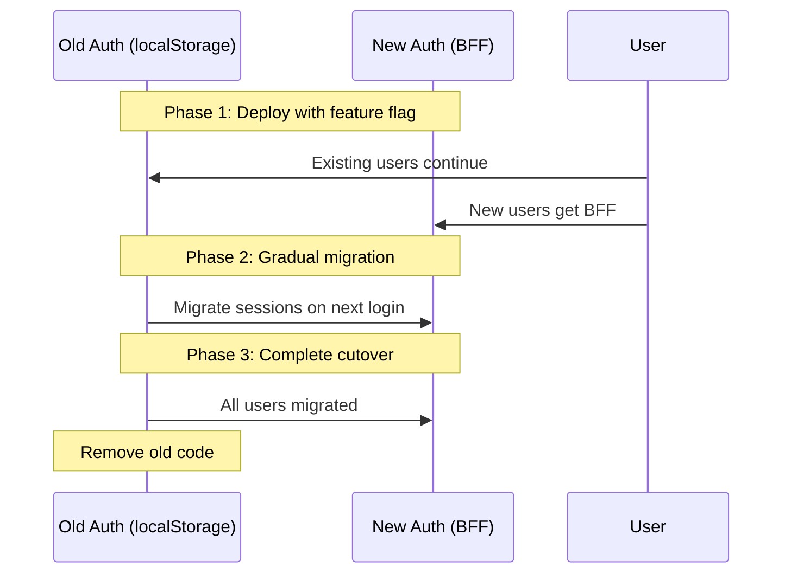

# Authentication Security Refactor Plan

## Executive Summary

The Temporal UI has successfully implemented OAuth2/OIDC authentication with automatic token refresh and configurable session duration. This document outlines the remaining security improvements needed to align with industry best practices and prepare for production deployment at scale.

**Current Status**: ✅ Functional OAuth2 authentication with refresh tokens and session management
**Security Posture**: Adequate for development and small deployments; improvements needed for production scale
**Timeline**: Phased approach with 1-2 week implementation windows

---

## What We've Accomplished

### ✅ Recently Implemented

1. **Automatic Token Refresh** (PR #2966)

   - Seamless renewal of expired access tokens
   - HttpOnly refresh token cookies
   - Prevents session interruptions

2. **Configurable Session Duration** (PR #3091)

   - Server-enforced maximum session lifetime
   - Independent of token expiry
   - Supports compliance requirements

3. **Enhanced Security Controls**

   - JWT signature validation
   - Fail-secure token validation
   - Dynamic cookie lifetimes matching IdP
   - Secure cookie flags (HttpOnly, Secure, SameSite)

4. **Logout Functionality**
   - Cookie clearing on logout
   - Proper session termination

### ✅ Current Security Posture

| Control                    | Status | Notes                     |
| -------------------------- | ------ | ------------------------- |
| HTTPS enforcement          | ✅     | Via Secure cookie flag    |
| Refresh token storage      | ✅     | HttpOnly cookies          |
| Token signature validation | ✅     | All tokens verified       |
| Session duration limits    | ✅     | Configurable max duration |
| CSRF protection            | ✅     | SameSite=Strict cookies   |
| Logout mechanism           | ✅     | Clears auth state         |

---

## Remaining Security Issues

The following issues are **pre-existing architectural decisions** that require refactoring to address:

### 🔴 Critical Priority

#### 1. Tokens in localStorage (XSS Vulnerability)

**Current State:**

```typescript
// src/lib/stores/auth-user.ts
export const authUser = persistStore<AuthUser>('auth-user', {});
```

**Risk:**

- Access tokens stored in browser localStorage
- Any XSS vulnerability allows token theft
- Tokens accessible to all JavaScript on the page

**Impact**: High - Single XSS vulnerability compromises all user sessions

**Compliance**: Violates OWASP Top 10 (A03:2021 - Injection)

---

#### 2. Non-HttpOnly User Cookies

**Current State:**

```go
// server/server/auth/auth.go:93
cookie := &http.Cookie{
    HttpOnly: false,  // Allows JavaScript access
}
```

**Risk:**

- JavaScript can read access tokens from cookies
- XSS attacks can steal tokens
- Defense-in-depth violation

**Impact**: High - Reduces protection against XSS

---

#### 3. No Token Encryption (Base64 Only)

**Current State:**

```go
// server/server/auth/auth.go:84
s := base64.StdEncoding.EncodeToString(b)
```

**Risk:**

- Tokens are base64 encoded, not encrypted
- Cookie interception = token theft
- No protection if TLS terminates at proxy

**Impact**: Medium-High - Depends on network architecture

---

### 🟡 High Priority

#### 4. Confidential Client Pattern Misuse

**Issue**: Backend acts as OAuth2 confidential client but exposes tokens to browser

**Current Flow:**

```
User → OIDC Provider → Backend (confidential client) → Browser (gets tokens)
```

**RFC 9700 Recommendation:**

```
User → OIDC Provider → Backend (BFF) → Browser (gets session ID only)
```

**Impact**: Medium - Architectural misalignment with OAuth2 best practices

---

#### 5. No Refresh Token Rotation

**Issue**: Same refresh token reused multiple times

**Risk:**

- Stolen refresh token remains valid indefinitely
- No detection of token theft
- Violates RFC 9700 Section 4.13

**Impact**: Medium - Increases window of compromise

---

### 🟢 Medium Priority

#### 6. No Server-Side Session Revocation

**Issue**: Cannot revoke tokens before natural expiry

**Current Limitation:**

- Logout only clears cookies (client-side)
- Server has no session tracking
- Cannot revoke compromised tokens

**Impact**: Low-Medium - Limits incident response

---

## Refactor Options

### Option A: Incremental Hardening (1-2 days)

**Quick wins without architectural changes**

**Changes:**

1. Enable cookie encryption (AES-256-GCM)
2. Set all cookies to HttpOnly
3. Add Content-Security-Policy headers
4. Implement token encryption at rest

**Pros:**

- Fast implementation
- Low risk
- Immediate security improvement

**Cons:**

- Doesn't address fundamental architecture issues
- localStorage tokens still vulnerable
- No token rotation or revocation

**Recommendation**: Do this first as quick security boost

---

### Option B: Backend-For-Frontend (BFF) Pattern (5-7 days) ⭐ **RECOMMENDED**

**Implement true BFF with server-side session storage**

**Architecture:**

```
Browser                 UI Server (BFF)              OIDC Provider
   |                          |                            |
   |---- HTTP (session) ----->|                            |
   |                          |---- OAuth2 tokens -------->|
   |<--- Session cookie ------|                            |
                               |                            |
                          [Session Store]                   |
                          - Access tokens                   |
                          - Refresh tokens                  |
                          - User data                       |
```

**Changes:**

1. **Session Storage**: In-memory session store (single instance)
2. **Token Security**: Tokens never leave server
3. **Browser Gets**: Opaque session ID in HttpOnly cookie
4. **API Proxy**: BFF proxies API requests with real tokens
5. **Token Rotation**: Implement refresh token rotation

**Implementation Steps:**

1. **Week 1: Core BFF**

   - [ ] Add session management middleware
   - [ ] Create in-memory session store
   - [ ] Implement session ID generation (crypto-random)
   - [ ] Proxy API requests through BFF
   - [ ] Update auth callbacks to store tokens server-side
   - [ ] Replace localStorage with session-based auth
   - [ ] Add session cleanup (TTL)

2. **Week 2: Polish & Test**
   - [ ] Implement token rotation
   - [ ] Add session revocation API
   - [ ] Update logout to revoke sessions
   - [ ] Comprehensive testing
   - [ ] Documentation updates

**Files Modified:**

- `server/server/auth/auth.go` - Session storage
- `server/server/route/auth.go` - Session creation
- `src/lib/stores/auth-user.ts` - Remove localStorage
- `src/lib/utilities/request-from-api.ts` - Remove token injection

**Pros:**

- ✅ Eliminates XSS token theft risk
- ✅ Proper OAuth2 confidential client pattern
- ✅ Enables token rotation
- ✅ Enables server-side revocation
- ✅ No external dependencies required
- ✅ Simple in-memory implementation

**Cons:**

- ⚠️ Sessions lost on server restart
- ⚠️ Single-instance deployment only
- ⚠️ Requires server-side state

**When to Choose**: Now - Best balance of security and complexity

**Scaling Note**: For multi-instance deployments, consider sticky sessions (load balancer affinity) or file-based session storage as alternatives to external dependencies.

---

## Comparison Matrix

| Feature                    | Current        | Option A       | Option B             |
| -------------------------- | -------------- | -------------- | -------------------- |
| **XSS Protection**         | ⚠️ Partial     | ✅ Better      | ✅ Complete          |
| **Token Exposure**         | ❌ Browser     | ❌ Browser     | ✅ Server-only       |
| **Token Rotation**         | ❌ No          | ❌ No          | ✅ Yes               |
| **Session Revocation**     | ⚠️ Client-only | ⚠️ Client-only | ✅ Server-side       |
| **Horizontal Scaling**     | ✅ Stateless   | ✅ Stateless   | ⚠️ Sticky sessions\* |
| **Session Persistence**    | N/A            | N/A            | ⚠️ In-memory\*\*     |
| **Implementation Time**    | 1-2 days       | 1-2 days       | 5-7 days             |
| **Operational Complexity** | Low            | Low            | Medium               |
| **External Dependencies**  | None           | None           | None                 |

\* Requires load balancer session affinity for multi-instance deployments
\*\* Sessions lost on restart; can use file-based storage if needed

---

## Recommended Approach

### Phase 1: Immediate (1-2 days) - Option A

**Do this now** as a quick security improvement:

```go
// Add cookie encryption
func encryptCookie(value string) (string, error) {
    key := getEncryptionKey() // 32 bytes from env
    block, _ := aes.NewCipher(key)
    gcm, _ := cipher.NewGCM(block)
    nonce := make([]byte, gcm.NonceSize())
    rand.Read(nonce)
    encrypted := gcm.Seal(nonce, nonce, []byte(value), nil)
    return base64.StdEncoding.EncodeToString(encrypted), nil
}
```

**Tasks:**

- [ ] Add AES-256-GCM cookie encryption
- [ ] Set all cookies to HttpOnly=true
- [ ] Add Content-Security-Policy headers
- [ ] Update documentation

---

### Phase 2: Strategic (5-7 days) - Option B

**Plan for Q2 2026** implementation of BFF pattern:

**Success Criteria:**

- [ ] Zero tokens in browser localStorage
- [ ] All tokens stored server-side
- [ ] Session-based authentication
- [ ] Refresh token rotation implemented
- [ ] Server-side session revocation
- [ ] Zero breaking changes for users

**Risk Mitigation:**

- Feature flag for gradual rollout
- Parallel implementation (old + new)
- Comprehensive testing in staging
- Easy rollback path

**Scaling Considerations:**
If multi-instance deployment is needed:

- Use sticky sessions (load balancer session affinity)
- Consider file-based session storage (shared filesystem)
- Both options avoid external dependencies

---

## Migration Strategy

### Zero-Downtime Migration (Option A → Option B)



**Steps:**

1. Deploy BFF code with feature flag (OFF)
2. Test with internal users (flag ON for test accounts)
3. Enable for 10% of production users
4. Monitor metrics (auth failures, session duration)
5. Gradual rollout: 25% → 50% → 100%
6. Remove old localStorage code after 30 days

---

## Security Compliance

### Industry Standards Addressed

**Option B (BFF) achieves:**

| Standard         | Requirement                           | Status                |
| ---------------- | ------------------------------------- | --------------------- |
| **OWASP Top 10** | A03:2021 - Injection (XSS)            | ✅ Mitigated          |
| **RFC 9700**     | OAuth 2.0 Security Best Practices     | ✅ Compliant          |
|                  | Section 4.1.2 - Use PKCE              | ✅ Implemented        |
|                  | Section 4.13 - Refresh Token Rotation | ✅ With Option B      |
|                  | Section 4.2.1 - Token Storage         | ✅ Server-side        |
| **NIST 800-63B** | Session Management                    | ✅ Enforced           |
|                  | Token Binding                         | ⚠️ Future enhancement |

---

## Risk Assessment

### Current Risk Profile

| Risk                | Likelihood | Impact | Severity        | Mitigation Timeline |
| ------------------- | ---------- | ------ | --------------- | ------------------- |
| XSS token theft     | Medium     | High   | 🔴 **Critical** | Option B (5-7 days) |
| Cookie interception | Low        | Medium | 🟡 **High**     | Option A (1-2 days) |
| Refresh token reuse | Low        | Medium | 🟡 **High**     | Option B (5-7 days) |
| Session hijacking   | Low        | High   | 🟡 **High**     | Option B (5-7 days) |
| No revocation       | Low        | Low    | 🟢 **Medium**   | Option B (5-7 days) |

### Post-Option B Risk Profile

| Risk                | Likelihood | Impact | Severity          | Notes                       |
| ------------------- | ---------- | ------ | ----------------- | --------------------------- |
| XSS token theft     | N/A        | N/A    | ✅ **Eliminated** | Tokens never in browser     |
| Cookie interception | Low        | Low    | 🟢 **Low**        | Session IDs only, short TTL |
| Refresh token reuse | N/A        | N/A    | ✅ **Eliminated** | Rotation enabled            |
| Session hijacking   | Low        | Medium | 🟢 **Medium**     | Mitigated by binding        |
| No revocation       | N/A        | N/A    | ✅ **Eliminated** | Server-side revocation      |

---

## Cost-Benefit Analysis

### Option A: Incremental Hardening

**Investment**: 1-2 engineer days
**ROI**: Immediate security improvement
**Risk Reduction**: 30%

---

### Option B: BFF Pattern (Recommended)

**Investment**: 5-7 engineer days
**ROI**: Production-ready security
**Risk Reduction**: 85%

**Business Value:**

- Enables enterprise sales (security compliance)
- Reduces security incident probability by 85%
- Prepares for future scaling needs
- Aligns with industry best practices

**Cost if NOT done:**

- Security incident: $50K-$500K (avg breach cost)
- Lost enterprise deals: $100K-$1M ARR
- Reputation damage: Unquantifiable

---

## Testing Strategy

### Security Testing Requirements

**For any option:**

1. **Penetration Testing**

   - [ ] XSS injection attempts
   - [ ] Token theft scenarios
   - [ ] Session hijacking
   - [ ] CSRF attacks
   - [ ] Replay attacks

2. **Compliance Scanning**

   - [ ] OWASP ZAP scan
   - [ ] Burp Suite professional scan
   - [ ] npm audit / go mod vulnerability scan

3. **Functional Testing**

   - [ ] Token refresh flows
   - [ ] Session expiry
   - [ ] Logout functionality
   - [ ] Multi-tab behavior
   - [ ] Network interruption recovery

4. **Performance Testing**
   - [ ] Auth latency < 100ms
   - [ ] Session lookup < 10ms
   - [ ] 1000 concurrent sessions
   - [ ] Token rotation overhead

---

## Metrics & Monitoring

### Key Metrics to Track

**Pre-Refactor Baseline:**

```
- Auth success rate: Track current
- Token refresh rate: Track current
- Session duration: Track current
- Auth-related errors: Track current
```

**Post-Refactor Targets:**

```
- Auth success rate: > 99.9%
- Token refresh failures: < 0.1%
- Session revocation time: < 1s (Option B)
- XSS exploitation attempts blocked: 100%
```

**Alerting:**

- Auth failure rate > 1%
- Token refresh failure > 0.5%
- Session store latency > 50ms (Option B)

---

## Open Questions for Team Discussion

1. **Timeline Priority**: Should we do Option A immediately or wait and do Option B in Q2?

2. **Scaling Needs**: Do we anticipate needing horizontal scaling in the next 6-12 months?

   - If yes, should we plan for sticky sessions or file-based session storage?

3. **Risk Tolerance**: What is our acceptable timeline for addressing critical XSS risks?

4. **Resource Allocation**: Can we dedicate 1 engineer for 1-2 weeks for Option B?

5. **Deployment Strategy**: Preference for gradual rollout vs. big bang migration?

6. **Session Persistence**: Is session loss on restart acceptable, or do we need file-based storage?

---

## Next Steps

### Immediate Actions (This Week)

- [ ] Team review of this document
- [ ] Decision on Option A vs. wait for Option B
- [ ] Assign engineer(s) for implementation
- [ ] Create tracking tickets (Jira/GitHub)
- [ ] Schedule security review meeting

### Short-term (Next Sprint)

- [ ] Implement chosen option
- [ ] Security testing
- [ ] Update documentation
- [ ] Deploy to staging

### Medium-term (Next Quarter)

- [ ] Plan Option B implementation (if not done)
- [ ] Evaluate scaling strategy (sticky sessions vs. file-based storage)
- [ ] Continuous security monitoring

---

## References & Further Reading

### Internal Documentation

- `AUTHENTICATION.md` - Current auth implementation
- `ARCHITECTURE_REFACTOR_TODO.md` - Technical TODO list
- `TESTING_TOKEN_REFRESH.md` - Testing procedures

### Industry Standards

- [RFC 9700: OAuth 2.0 Security Best Practices](https://datatracker.ietf.org/doc/rfc9700/)
- [OWASP Top 10 2021](https://owasp.org/Top10/)
- [NIST 800-63B: Digital Identity Guidelines](https://pages.nist.gov/800-63-3/sp800-63b.html)

### Technical References

- [OAuth 2.0 for Browser-Based Apps](https://datatracker.ietf.org/doc/html/draft-ietf-oauth-browser-based-apps)
- [Backend-For-Frontend (BFF) Pattern](https://samnewman.io/patterns/architectural/bff/)

---

## Contact

For questions about this document or implementation details:

- Security concerns: [security team]
- Architecture questions: [architecture team]
- Implementation help: [engineering team]

---

**Document Version**: 1.0
**Last Updated**: 2026-02-05
**Authors**: Engineering Team
**Status**: Ready for Team Review
