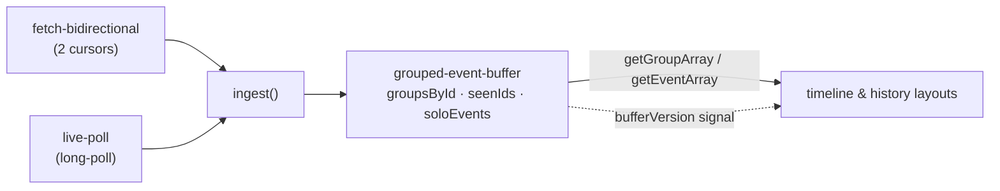

# Timeline & Event History Architecture

The mental model and the invariants behind the workflow timeline / event
history. It deliberately avoids line-by-line mechanics (those live in the code
and rot fast here) — read it for _why_ the pieces are shaped the way they are.

Key files: `services/grouped-event-buffer.ts`, `services/fetch-bidirectional.ts`,
`services/live-poll.ts`, `layouts/workflow-run-layout.svelte`,
`components/lines-and-dots/timeline-graph/`.

## The model: one store, one signal

All event data lives in a single module-level singleton, the
**grouped-event-buffer**. Two producers feed it and the UI reads from it:

The buffer is **plain TypeScript — no `$state`, no stores inside the module.**
Svelte reactivity is entered only at the boundary: the layout bumps a single
`bufferVersion` writable after each batch of events, and consumers re-read the
buffer in a `$derived` that depends on `$bufferVersion`. The signal carries only
"something changed" — never the data itself.

Why not make the buffer reactive (Svelte `$state`/`SvelteMap`)? At tens of
thousands of events, per-item reactivity means per-event signal churn. Mutating
plain structures silently and signalling once per batch is the whole point.

## Invariants

These change slowly; rely on them.

1. **One copy of each event.** An event lives in exactly one group's `eventList`
   (or in `soloEvents`). Nothing is copied into a second structure.
2. **A group is visible only once its head has arrived.** Followers that arrive
   first are parked and flushed in when the head lands — no stub/partial groups.
3. **Dedup is a single set.** Both fetch cursors and the live poll pass through
   the same `seenIds` guard, so overlap between them is dropped once.
4. **Metadata changes swap the group reference.** `enrichGroups` hands back a
   _new_ group object when a group's pending state changes (see Reactivity).
5. **UI updates only via `bufferVersion` or a fresh array reference** — never by
   the UI observing buffer internals.

## Group assembly (park-and-flush)

A group (Activity, Timer, Child Workflow, Nexus, …) is 2–5 events where only the
**head** (e.g. `ActivityTaskScheduled`) carries the group id; followers
(Started, Completed, …) reference it. Events do not arrive in order — the
descending fetch cursor delivers higher ids first, and the live poll interleaves.

`ingest()` is the single path for both producers:

- **Head** → create the group, then flush any parked followers into it.
- **Follower, head present** → insert into the group (kept sorted by event id).
- **Follower, head absent** → park under the head id until the head arrives.
- **Non-group event** (WorkflowExecutionStarted/Completed/…) → `soloEvents`.

There is no separate live-vs-fetch store or reconciliation step: because both
producers share `ingest()`, `seenIds`, and one `groupsById` map, a duplicate
from either side is simply dropped.

## Reactivity: why references matter

Consumers track groups **by reference** (the timeline row pool reuses a slot
while `prev.group === group`; detail views read `group.pendingActivity` in a
`$derived`). So a change that mutates a group _in place_ without adding an event
— e.g. pausing a pending activity flips a `describe` flag but emits no history
event — is invisible: the reference is unchanged and nothing re-derives.

`enrichGroups` therefore **clones the group** (preserving its accessor getters,
sharing its `eventList`) and swaps the new reference into the store whenever
pending metadata actually changes. Appends are already covered because they grow
`eventList`, which the row pool keys on. Rule of thumb: **any buffer change a
view must see either grows `eventList` or produces a new group reference.**

## Why bidirectional fetch (and why 2× is the ceiling)

Temporal's history API is **token-paginated**: each page's cursor comes from the
previous page, so you can't seek to an arbitrary offset or fan out N parallel
requests. The only two anchors available without a prior request are
ascending-from-1 and descending-from-newest, so `fetch-bidirectional` runs those
two cursors concurrently until they meet in the middle — ~2× throughput on large
histories, and the descending cursor's first page gives an immediate total-count
estimate for sizing the timeline.

Breaking past 2× would need a _server_ change (e.g. an endpoint returning several
valid cursors at once), not a client one. Offset/page-number pagination is not
the answer — it degrades to an O(offset) scan server-side and still can't produce
independent start points.

## Virtualization

The timeline can have tens of thousands of rows; only a small windowed pool is
ever in the DOM. Rows are absolutely-positioned HTML divs (not SVG).

- **Row pool, not keyed `{#each}`.** A fixed set of slots (keyed by slot index)
  is reused; as you scroll, each slot re-points to a new group and only props
  update — no mount/unmount churn (which caused major-GC pauses).
- **Scroll-driven window, measured per frame.** A self-driven `requestAnimationFrame`
  loop reads the container's offset within its scroll parent to compute the
  visible band, then idles out after a few still frames. It listens to
  `scroll` + `wheel`/`touchmove` because a trackpad fling coalesces `scroll`.
  (This replaced an IntersectionObserver approach the browser throttled during
  fast scroll.)
- **Closed-form window bounds.** `getWindowBounds` is the analytic inverse of
  `getRowY`, mapping the pixel band to a `[start, end)` row range plus overscan —
  no per-row measurement.

### Loading-gap positioning

While the fetch streams, descending-cursor rows fill from the top and ascending
from the bottom, with a shrinking skeleton gap between. `getRowY` is therefore a
two-segment piecewise function (the descending segment is offset by the pending
row count derived from `descMinId` / `totalExpectedEvents`). Once the fetch
completes the pending count is 0 and it collapses to a single linear map — so the
piecewise math only runs during load. Geometry lives in `timeline-positioning.ts`;
time-axis compression of idle gaps in `timeline.svelte.ts` / `timeline-scale.svelte.ts`.
