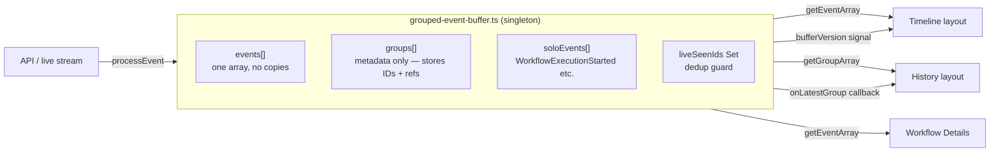
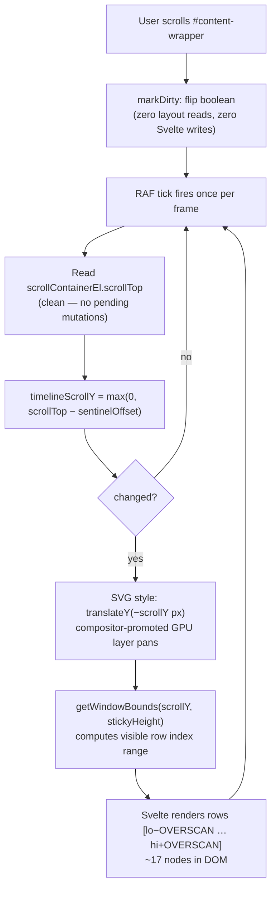

# Timeline & Event History Architecture

## Core Principle: One Copy, One Truth

All event data lives in a **single module-level singleton** (`grouped-event-buffer.ts`).
No Svelte stores hold event arrays. No component keeps a second copy.
Consumers call `getEventArray()` / `getGroupArray()` to read directly from the buffer.



### Key tenets

| Tenet                        | How                                                                                                                                                     |
| ---------------------------- | ------------------------------------------------------------------------------------------------------------------------------------------------------- |
| **No second data structure** | `EventGroup` is a metadata envelope — it stores event IDs and a reference to the head event; it does not copy field values                              |
| **No duplicate objects**     | `liveSeenIds` rejects any event ID seen before; `appendLiveEvent` and `processEvent` both gate on this set                                              |
| **Lazy detail rendering**    | Raw event payload is read from the existing array entry only when a detail panel opens — not on every group build                                       |
| **Solo events included**     | `WorkflowExecutionStarted` events that don't belong to a group live in `soloEvents[]` and are merged into `getEventArray()` at read time                |
| **Reactive signal is cheap** | `bufferVersion` is a plain Svelte `writable(0)` incremented on each buffer flush; consumers `$derived` off it to re-read without diffing the full array |

---

## Virtualization: Sticky Canvas + Sentinel Scroll

The timeline SVG can have 50 k+ rows. Only ~17 rows live in the DOM at any time.



### Layout elements

```
┌─────────────────────────────────────┐
│  Top nav  (fixed, --top-nav-height) │
├─────────────────────────────────────┤
│  Controls bar  (sticky, z-11)       │  ← bind:clientHeight → controlsHeight
├─────────────────────────────────────┤  ← sentinel div (h-0) marks this line
│                                     │
│  Sticky canvas  overflow-hidden     │  ← top: calc(nav + controlsHeight)
│  ┌───────────────────────────────┐  │    height: min(contentPx, 100dvh−nav−controls)
│  │  SVG  translateY(−scrollY)   │  │
│  │  [ OVERSCAN rows above ]     │  │
│  │  [ visible rows          ]   │  │
│  │  [ OVERSCAN rows below ]     │  │
│  └───────────────────────────────┘  │
│                                     │
├─────────────────────────────────────┤
│  Spacer div  height = spacerHeight  │  ← extends page scroll range
│  (pushes content below sticky area) │
└─────────────────────────────────────┘
```

**Scroll math**

- `sentinelOffset` — measured once at mount: distance from scroll container top to the sentinel (canvas entry point)
- `timelineScrollY = max(0, scrollTop − sentinelOffset)` — how far the virtual window has moved
- `spacerHeight = totalRows × ROW_PX − stickyHeight + panelHeight` — keeps the scrollbar thumb sized correctly
- `canvasContentHeight = max(totalRows × ROW_PX, 120) + panelHeight + 120` — natural height; CSS `min()` caps it at the viewport

---

## What Else Was Done (Full Change Summary)

### Regressions fixed vs master branch (A/B verified)

| Area                 | Issue                                                                                 | Fix                                                                                               |
| -------------------- | ------------------------------------------------------------------------------------- | ------------------------------------------------------------------------------------------------- |
| Compact view         | WFT groups leaked into Event History compact tab                                      | All `getGroupArray()` call sites pass `{ excludeWorkflowTasks: true }`                            |
| Event History rows   | Expand/collapse chevron missing                                                       | Restored `expandButton` snippet + `IconButton` in `event-summary-row.svelte`                      |
| Relationships tab    | Pan/zoom controls missing                                                             | Implemented `panBy`, `zoomBy`, keyboard handler, and button cluster in `zoom-svg.svelte`          |
| Auto Refresh button  | No-op; state not reflected in URL                                                     | Wired `pauseLiveUpdates` store, synced `refresh_off` URL param, implemented `onAutoRefreshToggle` |
| Timeline border      | Canvas rendered edge-to-edge (negative margins hid border)                            | Removed `-mx-4 md:-mx-8`; border now visible                                                      |
| Timeline gap         | 32 px phantom gap between controls and canvas (flex `gap-4` × sentinel)               | Wrapped controls + sentinel + canvas in single block-flow div                                     |
| Timeline top border  | `border-t-0` on graph with no parent supplying the top edge                           | Added `border-t border-subtle` to sticky canvas wrapper                                           |
| Controls overlap     | Canvas sticky at same `top` as controls bar; controls hid top of canvas when scrolled | Canvas sticky top = `calc(nav + controlsHeight)` measured live                                    |
| Canvas height        | Full-viewport height even for 2-event workflows                                       | `min(canvasContentHeight, 100dvh − nav − controls)` — compact for small, full-height for large    |
| Child workflow input | `null` for `WorkflowExecutionStarted` solo events                                     | `soloEvents[]` added to buffer; included in `getEventArray()` output                              |
| Duplicate key errors | Live streaming allowed duplicate event IDs                                            | `liveSeenIds` Set guards both `appendLiveEvent` and `processEvent`                                |
| i18n                 | Missing `expand-details` / `collapse-details` keys                                    | Added to `src/lib/i18n/locales/en/events.ts`                                                      |

### New tests

| File                           | Covers                                                                                       |
| ------------------------------ | -------------------------------------------------------------------------------------------- |
| `grouped-event-buffer.test.ts` | Compact view WFT regression; desc-cursor out-of-order arrival                                |
| `event-filter-params.test.ts`  | `refresh_off` URL param round-trips via `parseEventFilterParams` / `updateEventFilterParams` |
| `events.test.ts` (locale)      | `expand-details` and `collapse-details` i18n keys present                                    |

### Test infrastructure

- `temporal/activities/long-sleep.ts` — heartbeating `longSleep` + `alwaysFails` activities
- `temporal/workflows.ts` — 8 long-running open-state workflows for auto-refresh and timeline testing
- `scripts/start-long-running.ts` — runner registered as `pnpm run-workflows:long-running`
