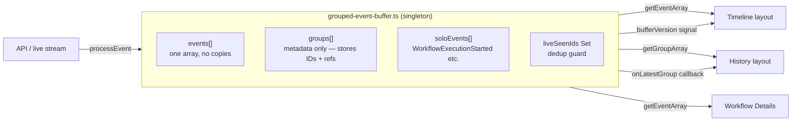
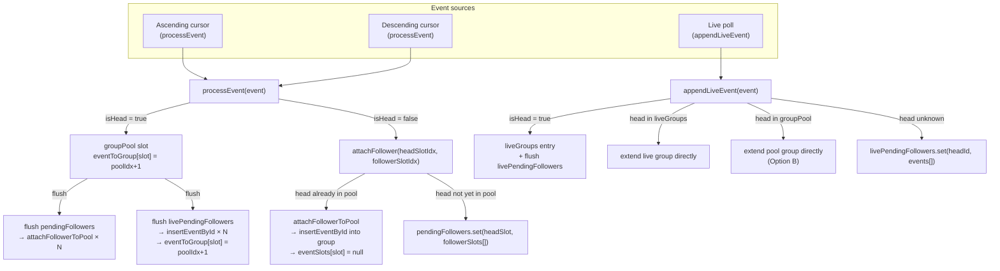
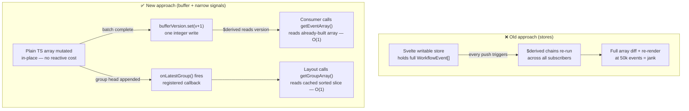
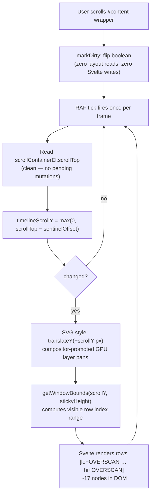

# Timeline & Event History Architecture

## Core Principle: One Copy, One Truth

All event data lives in a **single module-level singleton** (`grouped-event-buffer.ts`).
No Svelte stores hold event arrays. No component keeps a second copy.
Consumers call `getEventArray()` / `getGroupArray()` to read directly from the buffer.



### Key tenets

| Tenet                        | How                                                                                                                                                     |
| ---------------------------- | ------------------------------------------------------------------------------------------------------------------------------------------------------- |
| **No second data structure** | `EventGroup` is a metadata envelope — it stores event IDs and a reference to the head event; it does not copy field values                              |
| **No duplicate objects**     | `liveSeenIds` rejects any event ID seen before; `appendLiveEvent` and `processEvent` both gate on this set                                              |
| **Lazy detail rendering**    | Raw event payload is read from the existing array entry only when a detail panel opens — not on every group build                                       |
| **Solo events included**     | `WorkflowExecutionStarted` events that don't belong to a group live in `soloEvents[]` and are merged into `getEventArray()` at read time                |
| **Reactive signal is cheap** | `bufferVersion` is a plain Svelte `writable(0)` incremented on each buffer flush; consumers `$derived` off it to re-read without diffing the full array |

---

## Group Assembly: Park-and-Flush Pattern

Temporal events arrive out of order. A group (Activity, Timer, Child Workflow, …) is made up of 2–5 events where only the **head event** (e.g. `ActivityTaskScheduled`) carries the group identity. Followers (Started, Completed) reference the head by ID.

Two separate sources can deliver events concurrently:

- **Bidirectional fetch** — ascending cursor from event 1, descending cursor from the last event, racing toward the middle.
- **Live poll** — long-poll at the frontier while a workflow is running.

Both use the same core pattern: **park followers invisibly until the head arrives, then flush them into the group in one shot.**



### Four resolution paths for a follower event

| Source                   | Head already where? | Action                                                                                  |
| ------------------------ | ------------------- | --------------------------------------------------------------------------------------- |
| `processEvent` (bidir)   | groupPool           | `attachFollowerToPool` — inserts immediately, nulls raw slot                            |
| `processEvent` (bidir)   | Nowhere yet         | `pendingFollowers` map — parks slot index; flushed when head arrives                    |
| `appendLiveEvent` (live) | liveGroups          | Extends live group's `eventList` in place                                               |
| `appendLiveEvent` (live) | groupPool           | Extends pool group's `eventList` directly; marks `eventToGroup[followerSlot]`           |
| `appendLiveEvent` (live) | Nowhere yet         | `livePendingFollowers` map — parks converted `WorkflowEvent`; flushed when head arrives |

**A group only becomes visible in `getGroupArray()` once its head has been processed.** No partial or stub groups are rendered.

### What each map stores

```
pendingFollowers:    Map<headSlotIdx: number, followerSlotIdx[]: number[]>
                     ↑ slot indices only — raw HistoryEvent stays in eventSlots[]

livePendingFollowers: Map<headEventId: string, WorkflowEvent[]>
                      ↑ already-converted events — appendLiveEvent never writes to eventSlots
```

One copy of each event exists at any time — either waiting in a park map, or committed inside `group.eventList`.

### Dedup when both sources deliver the same event

`attachFollowerToPool` guards with:

```
if (eventToGroup[followerSlotIdx] !== 0) { null the slot; return; }
```

If `livePendingFollowers` already claimed a slot (by writing `eventToGroup[followerSlotIdx]` during flush), the bidirectional cursor's delivery of the same event is silently discarded.

### Live groups in `getGroupArray()`

Complete live groups (head delivered by live poll) are included alongside pool groups. Once `processEvent` claims the head (`eventToGroup[headSlot] !== 0`) the live group is excluded — the pool group takes over with an identical or superset `eventList`.

---

## Reactivity: Events and Callbacks, Not Svelte Primitives

The buffer is **plain TypeScript** — no `$state`, no `$derived`, no stores inside the module.
Svelte's reactive graph is only entered at the outermost boundary, via two narrow escape hatches.



### Why this matters at scale

|                  | Svelte store approach                           | Buffer + signal approach                                                  |
| ---------------- | ----------------------------------------------- | ------------------------------------------------------------------------- |
| 10 k event push  | Re-runs every `$derived` chain for each push    | Mutates array silently; one `bufferVersion` tick at end                   |
| Subscriber count | Every component watching the store re-evaluates | Only components that read `bufferVersion` or register via `onLatestGroup` |
| Memory per event | Two copies — one in store, one in group         | One copy in `events[]`; group holds a reference to the same object        |
| Render trigger   | Svelte decides (potentially every frame)        | Explicit: either a version bump or a callback — nothing else              |

### The two signal types

**`bufferVersion`** — a plain `writable(0)`. Consumers write:

```svelte
let rows = $derived.by(() => {
  $bufferVersion;           // subscribe to the tick
  return getEventArray();   // read the already-built array
});
```

No array is passed through the signal. The signal carries only the intent to re-read.

**`onLatestGroup(cb)`** — a callback registration (pub/sub, not Svelte reactive). Layouts register on mount and receive a teardown function. The buffer calls every registered callback synchronously after appending a new group head. No Svelte primitive involved — the callback fires imperative code that then reassigns a `$state` variable once, queueing exactly one Svelte flush.

---

## Virtualization: Sticky Canvas + Sentinel Scroll

The timeline SVG can have 50 k+ rows. Only ~17 rows live in the DOM at any time.



### Layout elements

```
┌─────────────────────────────────────┐
│  Top nav  (fixed, --top-nav-height) │
├─────────────────────────────────────┤
│  Controls bar  (sticky, z-11)       │  ← bind:clientHeight → controlsHeight
├─────────────────────────────────────┤  ← sentinel div (h-0) marks this line
│                                     │
│  Sticky canvas  overflow-hidden     │  ← top: calc(nav + controlsHeight)
│  ┌───────────────────────────────┐  │    height: min(contentPx, 100dvh−nav−controls)
│  │  SVG  translateY(−scrollY)   │  │
│  │  [ OVERSCAN rows above ]     │  │
│  │  [ visible rows          ]   │  │
│  │  [ OVERSCAN rows below ]     │  │
│  └───────────────────────────────┘  │
│                                     │
├─────────────────────────────────────┤
│  Spacer div  height = spacerHeight  │  ← extends page scroll range
│  (pushes content below sticky area) │
└─────────────────────────────────────┘
```

**Scroll math**

- `sentinelOffset` — measured once at mount: distance from scroll container top to the sentinel (canvas entry point)
- `timelineScrollY = max(0, scrollTop − sentinelOffset)` — how far the virtual window has moved
- `spacerHeight = totalRows × ROW_PX − stickyHeight + panelHeight` — keeps the scrollbar thumb sized correctly
- `canvasContentHeight = max(totalRows × ROW_PX, 120) + panelHeight + 120` — natural height; CSS `min()` caps it at the viewport

---

## What Else Was Done (Full Change Summary)

### Regressions fixed vs master branch (A/B verified)

| Area                 | Issue                                                                                 | Fix                                                                                               |
| -------------------- | ------------------------------------------------------------------------------------- | ------------------------------------------------------------------------------------------------- |
| Compact view         | WFT groups leaked into Event History compact tab                                      | All `getGroupArray()` call sites pass `{ excludeWorkflowTasks: true }`                            |
| Event History rows   | Expand/collapse chevron missing                                                       | Restored `expandButton` snippet + `IconButton` in `event-summary-row.svelte`                      |
| Relationships tab    | Pan/zoom controls missing                                                             | Implemented `panBy`, `zoomBy`, keyboard handler, and button cluster in `zoom-svg.svelte`          |
| Auto Refresh button  | No-op; state not reflected in URL                                                     | Wired `pauseLiveUpdates` store, synced `refresh_off` URL param, implemented `onAutoRefreshToggle` |
| Timeline border      | Canvas rendered edge-to-edge (negative margins hid border)                            | Removed `-mx-4 md:-mx-8`; border now visible                                                      |
| Timeline gap         | 32 px phantom gap between controls and canvas (flex `gap-4` × sentinel)               | Wrapped controls + sentinel + canvas in single block-flow div                                     |
| Timeline top border  | `border-t-0` on graph with no parent supplying the top edge                           | Added `border-t border-subtle` to sticky canvas wrapper                                           |
| Controls overlap     | Canvas sticky at same `top` as controls bar; controls hid top of canvas when scrolled | Canvas sticky top = `calc(nav + controlsHeight)` measured live                                    |
| Canvas height        | Full-viewport height even for 2-event workflows                                       | `min(canvasContentHeight, 100dvh − nav − controls)` — compact for small, full-height for large    |
| Child workflow input | `null` for `WorkflowExecutionStarted` solo events                                     | `soloEvents[]` added to buffer; included in `getEventArray()` output                              |
| Duplicate key errors | Live streaming allowed duplicate event IDs                                            | `liveSeenIds` Set guards both `appendLiveEvent` and `processEvent`                                |
| i18n                 | Missing `expand-details` / `collapse-details` keys                                    | Added to `src/lib/i18n/locales/en/events.ts`                                                      |

### New tests

| File                                   | Covers                                                                                                                          |
| -------------------------------------- | ------------------------------------------------------------------------------------------------------------------------------- |
| `grouped-event-buffer.test.ts`         | Compact view WFT regression; desc-cursor out-of-order arrival; concurrent live poll dedup; `livePendingFollowers` park-flush    |
| `live-poll.test.ts`                    | Token-based long-poll loop; pause/resume cursor retention; backoff; abort behavior                                              |
| `fetch-bidirectional.test.ts`          | Ascending/descending race; abort guard; multi-page token following                                                              |
| `constants.test.ts`                    | `timelineTextPosition` all placement zones; status/category stroke colors; `CategoryIcon` mapping; `isMiddleEvent`              |
| `timeline-graph-row-rendering.test.ts` | Dot-position pixel math; dot count per group shape; pending-line conditions; live park-flush rendering inputs; retry/icon/color |
| `timeline-positioning.test.ts`         | `getDescStart`; `getTotalForY`; `getRowY` ascending/descending; `getPendingBlockY`; no-overlap invariants                       |
| `event-filter-params.test.ts`          | `refresh_off` URL param round-trips via `parseEventFilterParams` / `updateEventFilterParams`                                    |
| `events.test.ts` (locale)              | `expand-details` and `collapse-details` i18n keys present                                                                       |

### Test infrastructure

- `temporal/activities/long-sleep.ts` — heartbeating `longSleep` + `alwaysFails` activities
- `temporal/workflows.ts` — 8 long-running open-state workflows for auto-refresh and timeline testing
- `scripts/start-long-running.ts` — runner registered as `pnpm run-workflows:long-running`
