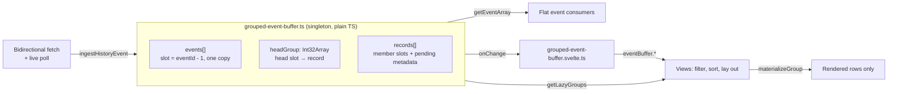
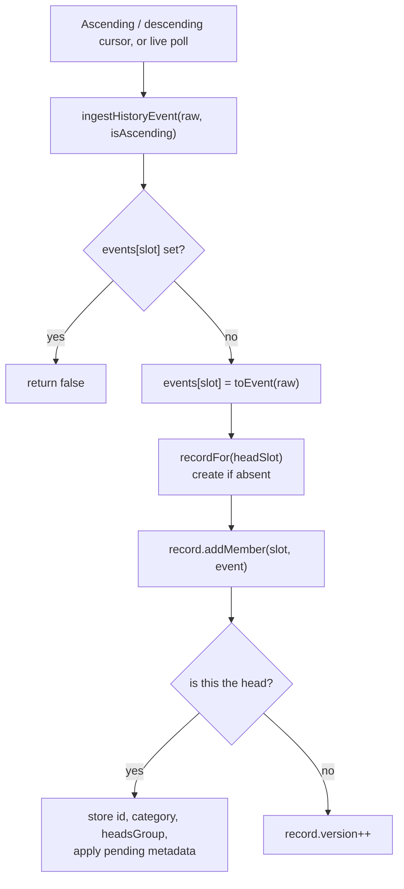
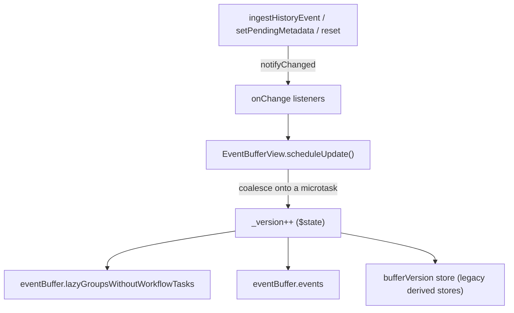
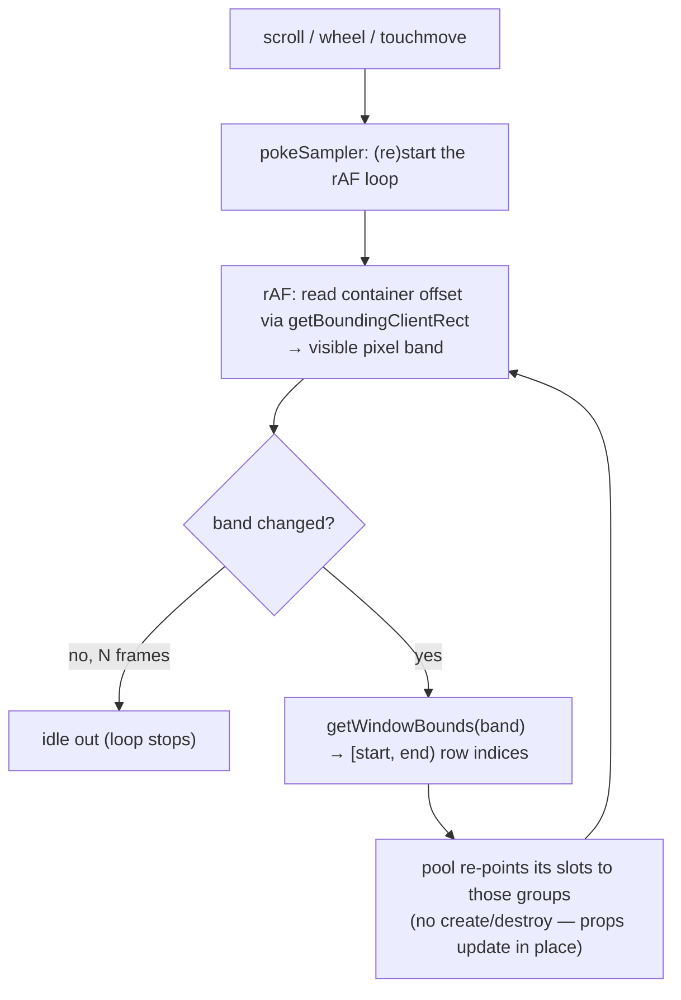

# Timeline & Event History Architecture

## Core Principle: Events Are Canonical, Groups Are Derived

All event data lives in a **single module-level singleton** (`grouped-event-buffer.ts`).
Events are stored once, in a flat array indexed by `eventId - 1`. Groups are not
stored at all — they are described by lightweight records and built on demand.

The flat array works because Temporal event IDs are a gapless sequence from 1, so
the ID _is_ the position. That buys more than storage: a follower references its
head by event ID (`scheduledEventId`, `startedEventId`, …), so the same arithmetic
resolves it to `headGroup[headSlot]` in one array read, with no index to maintain.
Were the IDs ever sparse the array would simply have holes — every read already
skips empty slots — costing memory rather than correctness.


```mermaid
flowchart LR
    API["Bidirectional fetch<br/>+ live poll"] -->|ingestHistoryEvent| BUF

    subgraph BUF["grouped-event-buffer.ts (singleton, plain TS)"]
        direction TB
        EV["events[]<br/>slot = eventId - 1, one copy"]
        HG["headGroup: Int32Array<br/>head slot → record"]
        GR["records[]<br/>member slots + pending metadata"]
    end

    BUF -->|getLazyGroups| VIEW["Views: filter, sort, lay out"]
    VIEW -->|materializeGroup| ROW["Rendered rows only"]
    BUF -->|getEventArray| FLAT["Flat event consumers"]

    BUF -->|onChange| FACADE["grouped-event-buffer.svelte.ts"]
    FACADE -->|eventBuffer.*| VIEW
```

### Key tenets

| Tenet                           | How                                                                                                                                                 |
| ------------------------------- | --------------------------------------------------------------------------------------------------------------------------------------------------- |
| **One store, one copy**         | `events[slot]` holds the only converted `WorkflowEvent`; records reference it by slot index                                                         |
| **Groups cost nothing to list** | A `LazyGroup` _is_ the record — `id`, `category`, `isPending`, head/last event. Enough to filter, sort and lay out without building an `EventGroup` |
| **Materialize what renders**    | `materializeGroup` builds the full `EventGroup`, memoized on the record's version — ~54 pooled timeline rows, or one 100-row compact page           |
| **One dedup check**             | `if (events[slot]) return false` — both producers write through the same guard                                                                      |
| **Identity tracks content**     | An unchanged group returns the identical object; a changed one always returns a new object                                                          |

---

## Group Assembly: Arrival Order Doesn't Matter

Temporal events arrive out of order. A group (Activity, Timer, Child Workflow, …)
is 2–5 events where only the **head event** (e.g. `ActivityTaskScheduled`) carries
the group identity; followers reference the head by ID.

Two sources deliver concurrently:

- **Bidirectional fetch** — ascending cursor from event 1, descending cursor from the last, racing toward the middle.
- **Live poll** — long-poll at the frontier while a workflow is running.

Both call `ingestHistoryEvent`, which stores the event and notes its slot on a
record for the group it belongs to. The record is created by **whichever member
arrives first** — head or follower — so no event ever has to wait somewhere for
its group to exist.


```mermaid
flowchart TD
    ANY["Ascending / descending cursor, or live poll"] --> ING["ingestHistoryEvent(raw, isAscending)"]
    ING --> DEDUP{"events[slot] set?"}
    DEDUP -- yes --> DROP["return false"]
    DEDUP -- no --> STORE["events[slot] = toEvent(raw)"]
    STORE --> REC["recordFor(headSlot)<br/>create if absent"]
    REC --> ADD["record.addMember(slot, event)"]
    ADD --> HEAD{"is this the head?"}
    HEAD -- yes --> META["store id, category, headsGroup,<br/>apply pending metadata"]
    HEAD -- no --> BUMP["record.version++"]
```

A record with no head event yet is simply not listed — `getLazyGroups` skips any
record whose `headsGroup` is false. **No partial or stub groups are ever rendered**,
and the order events arrive in does not change the result.

### What this replaced

Because groups used to be built during ingest, an event whose group didn't exist
yet had nowhere to go. The answer was to hold it: two park maps (`pendingFollowers`
keyed by slot, `livePendingFollowers` keyed by event id), a flush when the head
registered, a separate `liveGroups` store for groups the poll created, and a
reconcile step when the fetch caught up to one.

Deriving groups on read removes the question. The event goes in `events[slot]` and
its slot number goes on the record, whichever arrives first.

### Pending activity / nexus metadata

This is the one input that isn't in the history. The workflow run reports it, so
`setPendingMetadata` hands the buffer the two lookup maps; the buffer applies them
when a head event lands and re-applies on refresh. Callers don't have to know the
ordering rule — a head that arrives after the refresh listing it still picks its
own up.

It is applied when a group is **built**, gated on the group not already holding a
terminal event, so a stale pending entry and a completion resolve the same way in
either arrival order.

---

## Reactivity: A Plain Buffer Behind a Thin Reactive Facade

The buffer is **plain TypeScript** — no `$state`, no `$derived`, no stores inside
the module, so it unit-tests without a component runtime. Svelte is entered in
exactly one place: `grouped-event-buffer.svelte.ts`.


```mermaid
flowchart TD
    W["ingestHistoryEvent / setPendingMetadata / reset"] -->|notifyChanged| OC["onChange listeners"]
    OC --> FV["EventBufferView.scheduleUpdate()"]
    FV -->|coalesce onto a microtask| VER["_version++ ($state)"]
    VER --> D1["eventBuffer.lazyGroupsWithoutWorkflowTasks"]
    VER --> D2["eventBuffer.events"]
    VER --> D3["bufferVersion store (legacy derived stores)"]
```

Consumers read a value:

```svelte
const lazyGroups = $derived(eventBuffer.lazyGroupsWithoutWorkflowTasks);
```

No subscribe / throttle / re-read effect at the call site, and **producers never
announce their own writes** — the buffer reports them.

- **Coalescing is a microtask, deliberately not `requestAnimationFrame`.** Fetch
  pages and poll batches are ingested in synchronous loops, so a batch collapses
  into one update either way — but rAF never fires in a hidden tab, which would
  leave a run opened in a background tab with an empty history until focused.
- **`reset` propagates immediately** rather than coalescing, so navigating between
  runs cannot leave the previous run's groups on screen for a tick.
- **`bufferVersion`** survives as a store mirror of `eventBuffer.version`, for the
  pre-runes `derived()` stores in `$lib/stores/events`. Prefer `eventBuffer` in new code.

### The identity invariant

`materializeGroup` is memoized on the record's version, so group identity is a pure
function of content. That is what the timeline row pool depends on: it reuses a row
while the group is unchanged, so a group extended **in place** would leave a
completed activity rendering as still in progress. Making identity structural
removes a convention every call site otherwise has to remember.

The corollary: a `LazyGroup`'s own identity is stable for the whole run, so anything
caching per group must compare `version` too, not just the reference.

---

## Deriving on Read: What Gets Materialized

Nothing upstream of a rendered row needs a full `EventGroup`:

| Consumer                           | Reads                            |
| ---------------------------------- | -------------------------------- |
| Event-type filter (both layouts)   | `category`                       |
| `sort-timeline-groups`             | `isPending`, `initialEvent.id`   |
| `get-failed-or-pending`            | `classification`, `initialEvent` |
| `build-time-segments` (gap layout) | head and last event times        |
| Row pool index map                 | `id`                             |

So those run over `LazyGroup[]`, and only the rendered rows call `materializeGroup`.
Opening a view on a large history used to build every group in it.

A `LazyGroup` and its materialized `EventGroup` **must agree field for field**, or a
view filters on one and renders the other. `isPending` and `category` share one
implementation so they cannot diverge; the rest are compared at every prefix of
every group type, over a field list that TypeScript forces to stay exhaustive.

The **feed view is the exception** and still takes full groups: its gutter graph does
cross-group layout needing `eventList`, `level`, and reverse event→group lookups
(`history-graph`, `positioning`).

---

## Virtualization: Scroll-Driven Window + Row Pool

The timeline can have tens of thousands of rows; only a small pooled window is
ever in the DOM. Rows are plain absolutely-positioned **HTML** divs (not SVG).


```mermaid
flowchart TD
    A["scroll / wheel / touchmove"] --> B["pokeSampler: (re)start the rAF loop"]
    B --> C["rAF: read container offset via getBoundingClientRect\n→ visible pixel band"]
    C --> D{band changed?}
    D -- no, N frames --> E["idle out (loop stops)"]
    D -- yes --> F["getWindowBounds(band) → [start, end) row indices"]
    F --> G["pool re-points its slots to those groups\n(no create/destroy — props update in place)"]
    G --> C
```

- **The container is the full drawn height** (`svgHeight`) and scrolls with the
  page inside its overflow ancestor (found via `findScrollParent`, in practice
  `#content-wrapper`). There is no `translateY`, no sentinel, and no spacer div —
  the page scrolls the tall container directly.
- **Band measurement is scroll-driven, per frame.** A self-driven `requestAnimationFrame`
  loop reads the container's offset within its scroll parent each frame and idles
  out after a few still frames. It's kept alive by `scroll` **and** `wheel` /
  `touchmove`, because a wheel/trackpad fling fires `wheel` but coalesces `scroll`
  — an event-only measure goes stale mid-fling and rows blank out. (This replaced
  an earlier IntersectionObserver approach, which the browser throttles during
  fast scroll.)
- **`getWindowBounds`** is the closed-form inverse of `getRowY` — it maps the
  visible band to a `[start, end)` row-index range (ascending/descending/pending-gap
  aware), plus `OVERSCAN` rows on each side.
- **Row pool.** Instead of a keyed `{#each}` that creates/destroys rows as the
  window slides, a fixed-size set of slots (keyed by slot **index**) is reused. As
  you scroll, each slot re-points to a new group — the `<li>` and its component
  instance stay mounted and only props update. This removed the `cloneNode` /
  insert / effect-teardown churn that was tripping frequent major-GC pauses.
- **Slots hold `LazyGroup`s** and materialize per rendered row. A slot is reused
  when its index, group **and version** all match; identity alone is not enough,
  since a lazy group keeps its identity across content changes.

### Positioning math (`timeline-graph/timeline-positioning.ts`)

- `getRowY(i, …)` — y (px) for the group at index `i`; descending-cursor rows
  shift down by `pendingGroupCount` to open the loading gap.
- `getPendingBlockY(…)` — top of the skeleton gap rectangle.
- `getDescStart` / `getTotalForY` — locate the cursor split and the descending-sort
  denominator.
- Row height and dot radius come from `timeline-graph/constants.ts`
  (`ROW_HEIGHT`, `RADIUS`, `GUTTER`); the color helpers live in `lines-and-dots/colors.ts`.

> Point-in-time change summaries (regressions fixed, tests added, test-workflow
> setup) intentionally live in the PR description and git history, not here, so
> this document can stay a description of the _current_ architecture.
