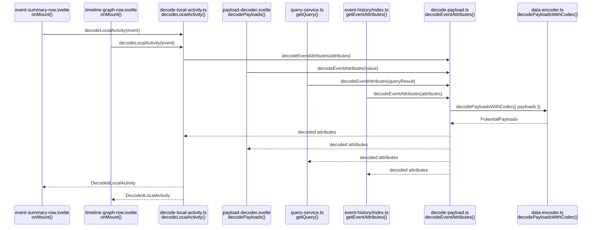
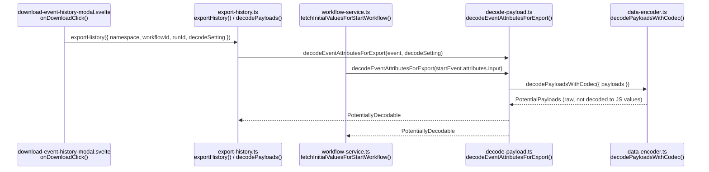
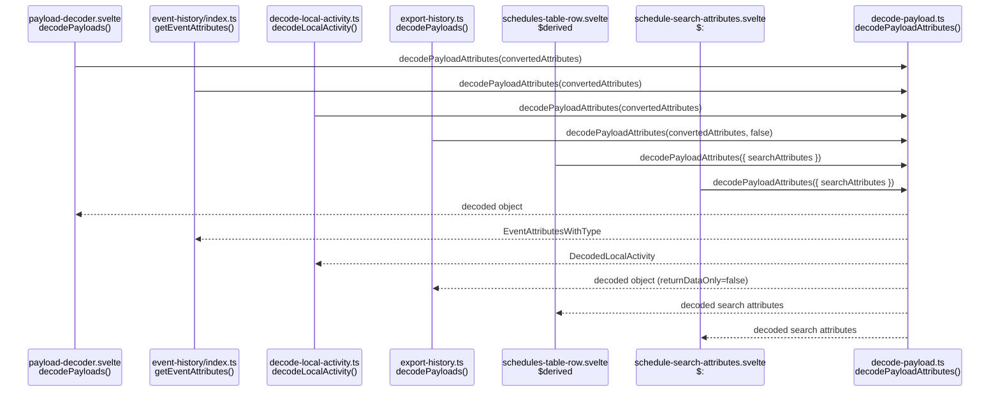
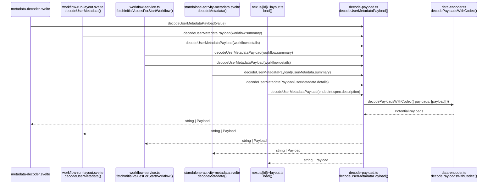
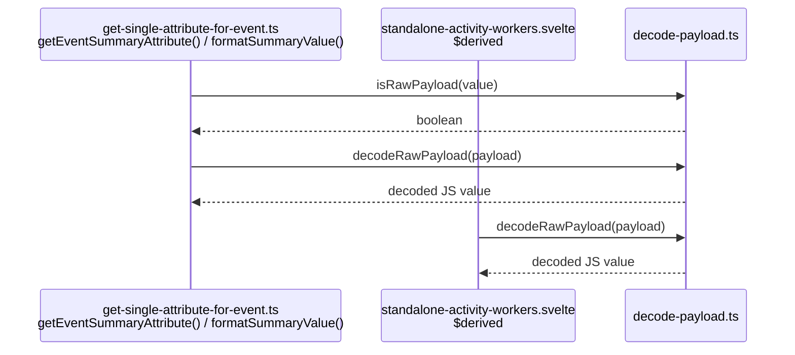

# `decode-payload.ts` Call Site Map

Sequence diagrams for all call sites of exports from
`src/lib/utilities/decode-payload.ts`.

---

## `decodeEventAttributes`

Async. Recursively walks payload attributes, sending `payloads` and
`encodedAttributes` keys through the codec endpoint.

---

## `decodeEventAttributesForExport`

Async. Same as `decodeEventAttributes` but `returnDataOnly=false` — payloads
are kept as structured objects rather than unwrapped JS values, preserving
metadata for JSON export.

---

## `decodePayloadAttributes`

Sync. Base64-decodes search attributes, memo, header, and queryResult fields
in-place. Called after the async codec pass.

---

## `decodeUserMetadataPayload`

Async. Decodes a single `summary` or `details` payload (user metadata) through
the codec endpoint. Returns the decoded value or the original payload on failure.

---

## `decodeRawPayload` / `isRawPayload`

Sync. Pure base64 → JS value conversion with no codec involvement.
`isRawPayload` checks whether an unknown value has the `{ metadata, data }`
shape before passing it to `decodeRawPayload`.

