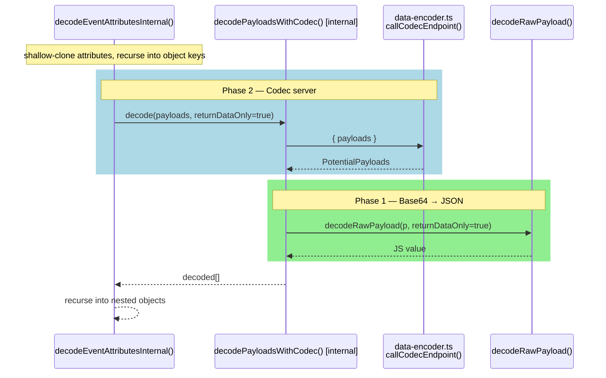
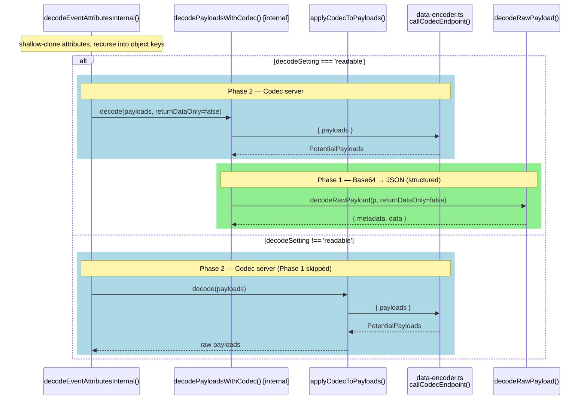
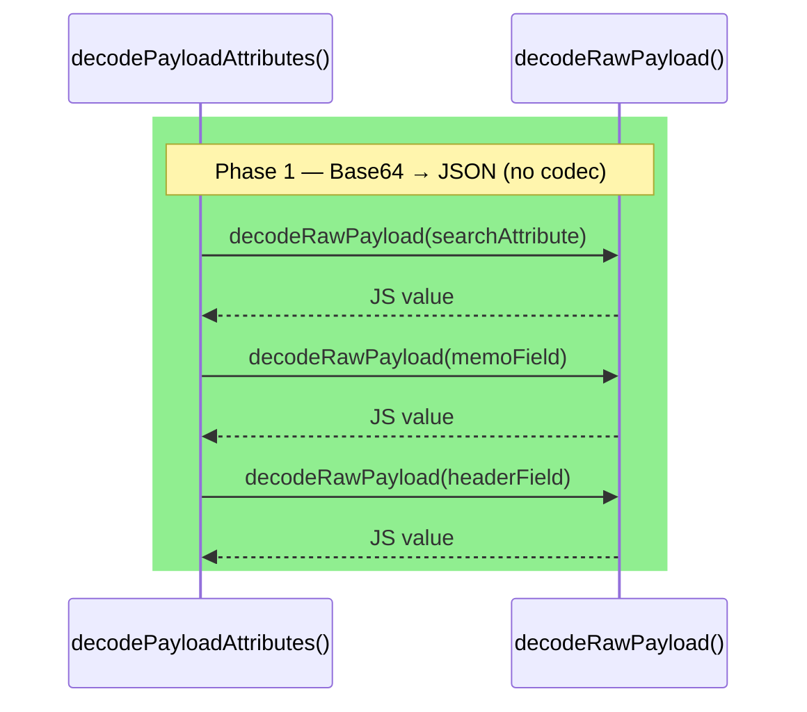
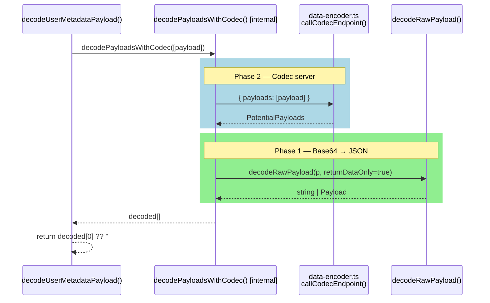
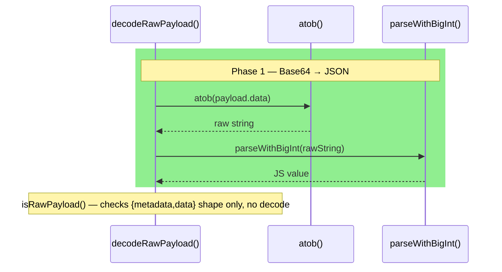

# `decode-payload.ts` — Decoding Phase Reference

Two phases apply whenever a Payload is decoded:

- **Phase 1 — Base64 → JSON**: `decodeRawPayload()` calls `atob()` + `parseWithBigInt()` to turn the raw `data` bytes into a JS value. Synchronous, no network.
- **Phase 2 — Codec server**: `callCodecEndpoint()` (re-exported from `data-encoder.ts`) POSTs payloads to the configured remote codec server and returns the transformed payloads. Async, may be skipped when no endpoint is configured.

Background colours below:

- **Blue** = Phase 2 (Codec server)
- **Green** = Phase 1 (Base64 → JSON)

---

## `decodeEventAttributes`

Recursively walks the attribute tree. For every `payloads` / `encodedAttributes`
key, runs Phase 2 then Phase 1 (`returnDataOnly=true` → bare JS values).

---

## `decodeEventAttributesForExport`

Same recursive walk as `decodeEventAttributes` but `returnDataOnly=false`,
so Phase 1 returns `{metadata, data}` objects instead of bare JS values.
When `decodeSetting` is not `'readable'`, Phase 1 is skipped entirely.

---

## `decodePayloadAttributes`

Handles structured fields only (`searchAttributes`, `memo`, `header`,
`queryResult`). Phase 2 is never involved — this is always the final
base64-decode pass applied after an async codec round-trip.

---

## `decodeUserMetadataPayload`

Decodes a single `summary` or `details` Payload. Delegates to the internal
`decodePayloadsWithCodec`, which runs both phases in sequence.

---

## `decodeRawPayload` / `isRawPayload`

No codec involvement. Phase 1 only.

